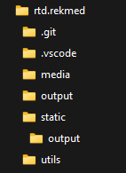
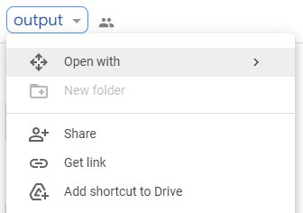
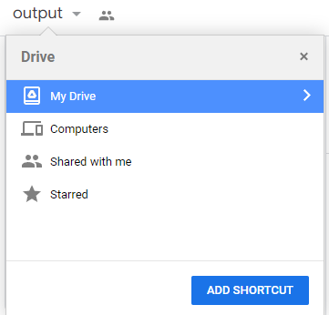
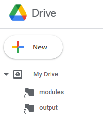
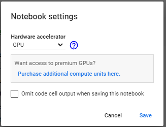
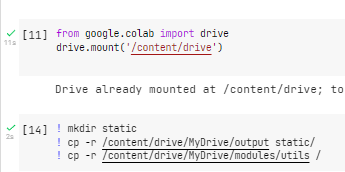
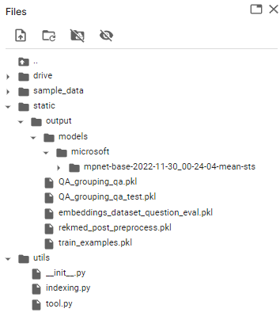
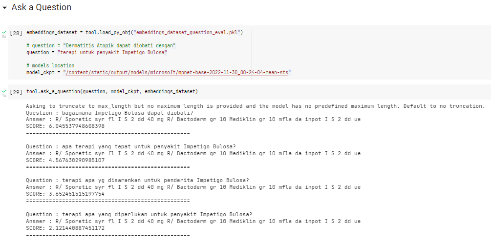

This program uses a dataset from [rekmed](https://rekmed.com/). To use the primary dataset, please contact the website admin. Regardless of the primary dataset, you can still use the program using the modified dataset.

We build a question-answering system based on known `diagnosa` to get `terapi ` & `tindakan` answers.

You can implement this program using the following: 
1. Local Setup (your local computer)
2. Google Colab


## 1. Local Setup

- If your local computer has GPU or Cuda enabled, follow these steps

```shell
$ git clone https://github.com/elhafizh/rtd.rekmed.git

$ conda create -y -n rtd python=3.9

$ conda activate rtd

$ pip install -r requirements.txt

$ pip install torch==1.10.1+cu113 torchvision==0.11.2+cu113 torchaudio==0.10.1 -f https://download.pytorch.org/whl/cu113/torch_stable.html
```

- Create a new folder called `static`

- Download [gdrive - output](https://drive.google.com/drive/folders/1XsPGKDoBV71NPMT_-CUFGn8J0lJ301dh?usp=sharing) and locate the downloaded folder into `static`



- To see the step-by-step process of creating the model for the question-answering system, please refer to `Rekmed_MQC.ipynb`.

- To have a quick look into the program, please refer to `mqc_overview.ipynb`.

- On `Rekmed_MQC.ipynb`: Because every process is time-consuming, use `tool.save_py_obj(variable_name)` to save the python variable to use in later processes (to create checkpoint). And using `tool.load_py_obj(file_name)` to load the stored variables.

- At the training phase, you can experiment and freely load BERT pre-trained model from [huggingface hub](https://huggingface.co/models). Or using the recommendation models from [SBERT](https://www.sbert.net/docs/pretrained_models.html#model-overview), especially for the Semantic Text Similarity Task.

```
model_name = "microsoft/mpnet-base"
sts_model = tool.STSModel(model_name, local=False)
```

## 2. Google Colab

- If you don't have any GPU or Cuda enabled on your local computer, try using google colab
- This collab implementation is similar to `mqc_overview.ipynb`, which only contains a system overview.
- Open [output gdrive](https://drive.google.com/drive/u/0/folders/1XsPGKDoBV71NPMT_-CUFGn8J0lJ301dh) and [modules gdrive](https://drive.google.com/drive/folders/1Oqt5WCfEYNSYgAccUoDBX0TCv5i873kh?usp=sharing)
- Select `Add shortcut to Drive.`



- Select the location on your `My Drive`, then click `ADD SHORTCUT`



- Make sure it is already in the correct location.



- Then open this [mqc_overview - google colab](https://colab.research.google.com/drive/111FDH-fiYq5gk4eVE7deW0CQINGe5K4j?usp=sharing)

- Enable GPU runtime



- After running these two cells



- Verify that this list of files is available within your project directory



- Test your question


